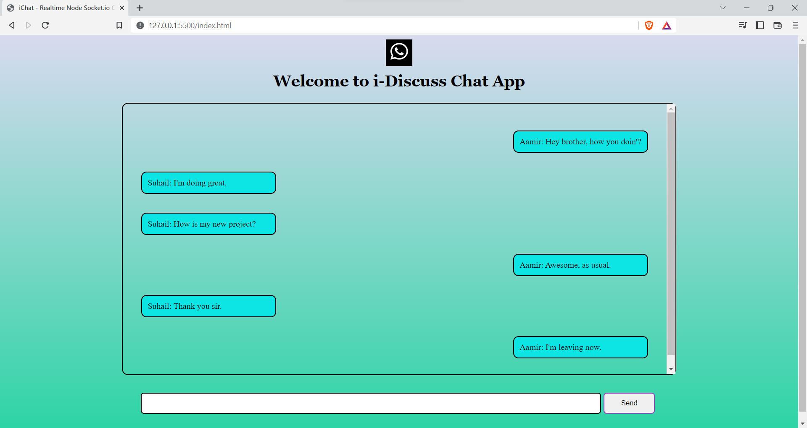

# Real-Time Chat App

The Real-Time Chat App is a modern communication platform that allows multiple users to communicate with each other in real time. This application leverages Node.js and Socket.io to provide seamless and instant messaging between users.

## Tools Used

- [Node.js](https://nodejs.org/): A JavaScript runtime for server-side applications.
- [Socket.io](https://socket.io/): A real-time engine for bidirectional communication between web clients and servers.

## Prerequisites

Before you can run the Real-Time Chat App, make sure you have the following prerequisites installed:

- [Node.js](https://nodejs.org/): You can install Node.js by visiting the official website.

To install Socket.io, open your terminal and run:

```npm install socket.io ```

## Getting Started

To run the Real-Time Chat App, follow these steps:

1. Start the Node.js server. Open your terminal and navigate to the project directory, then run: ```node ./nodeServer/index.js```

2. Open the `index.html` file in your preferred web browser.

3. Start chatting! You can open multiple tabs with the `index.html` file to simulate multiple client users.

## Features

The Real-Time Chat App offers the following features:

- **Real-Time Messaging**: Enjoy instant communication with other users in real time.
- **Multiple Users**: Simulate multiple client users by opening multiple tabs in your browser.
- **User-Friendly Interface**: An intuitive and easy-to-navigate chat interface.

## Contributing

We welcome contributions from the open-source community. If you have suggestions, find any issues, or want to improve this project, please follow these steps:

1. Fork the repository.
2. Create a new branch for your changes.
3. Make your changes and commit them.
4. Create a pull request with a clear description of your changes.

## License

This project is licensed under the MIT License. See the [LICENSE](LICENSE) file for details.

## Screenshots

Screenshots while testing:

Old images of working project




Image after recent changes (updated project)


Feel free to explore the Real-Time Chat App, enjoy instant communication, and contribute to its development. If you encounter any issues or have suggestions for improvements, please let us know.

Happy chatting!
